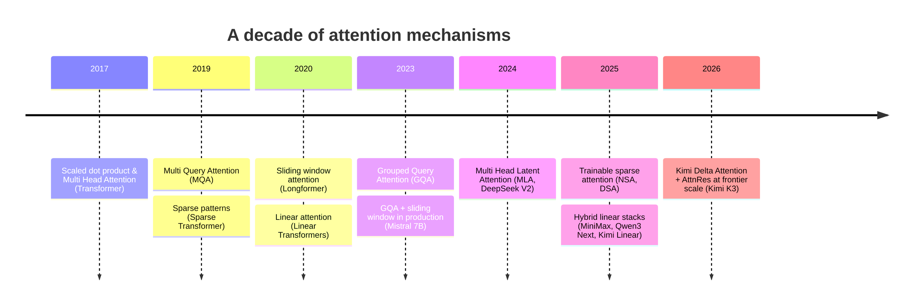
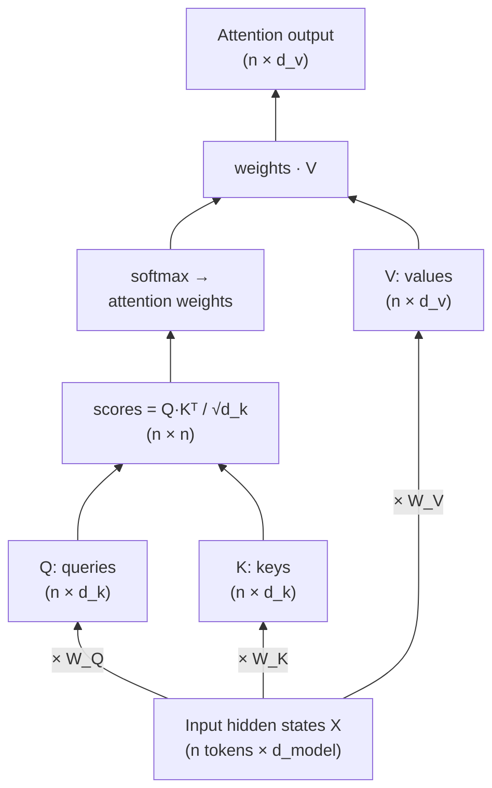
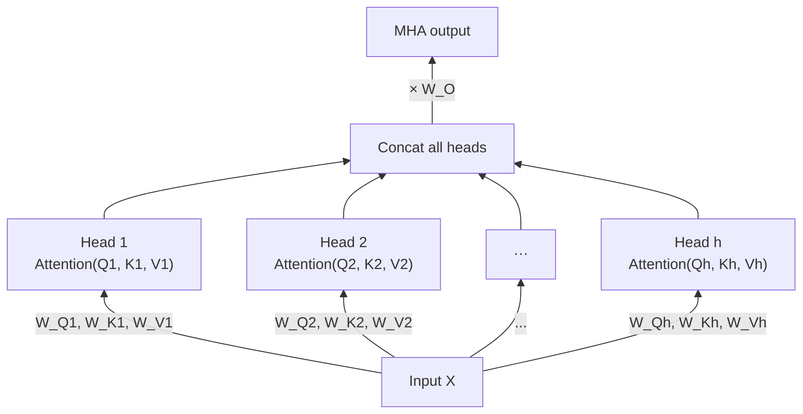
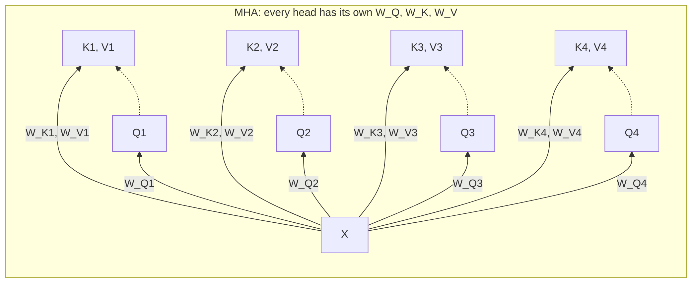
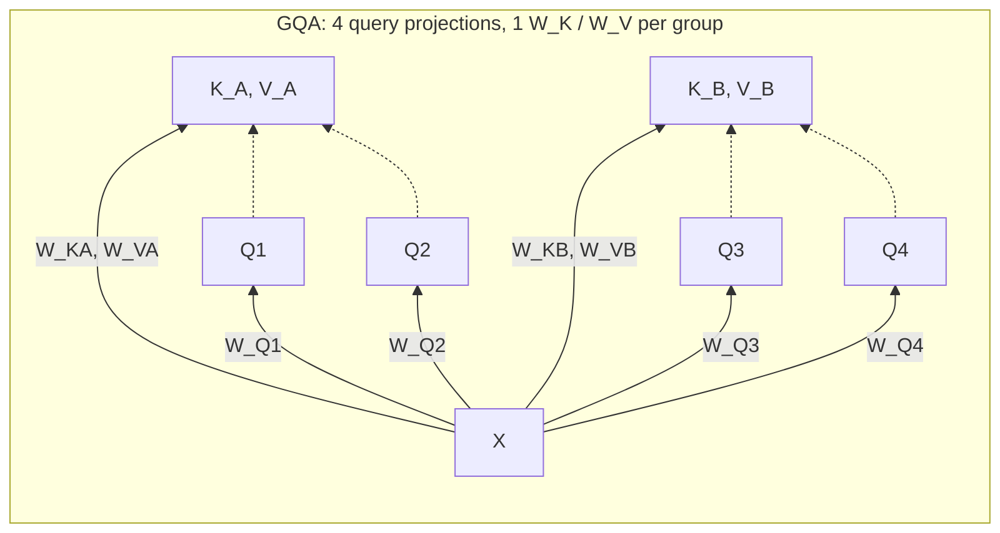
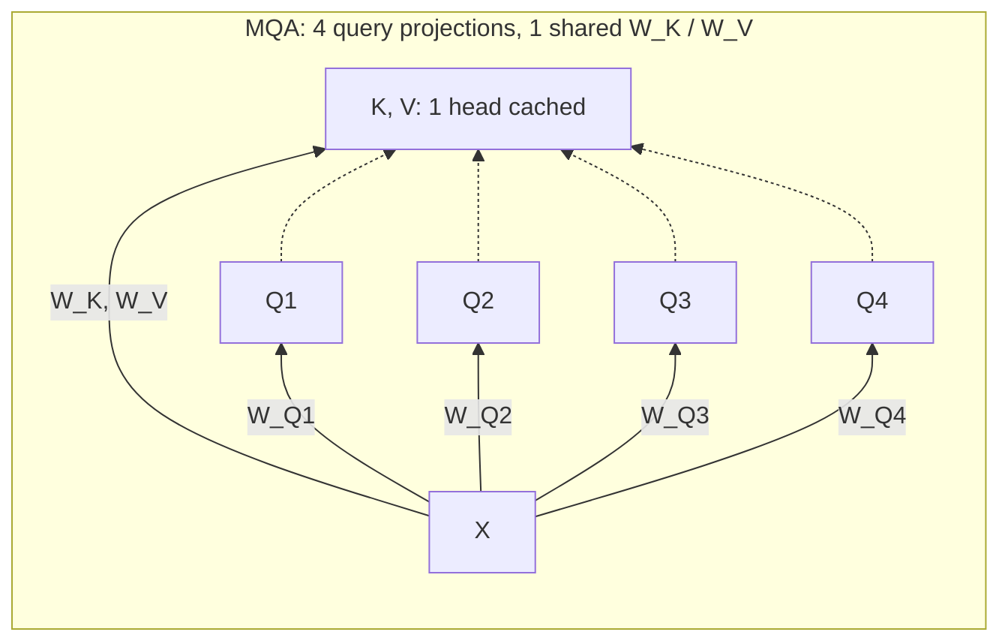
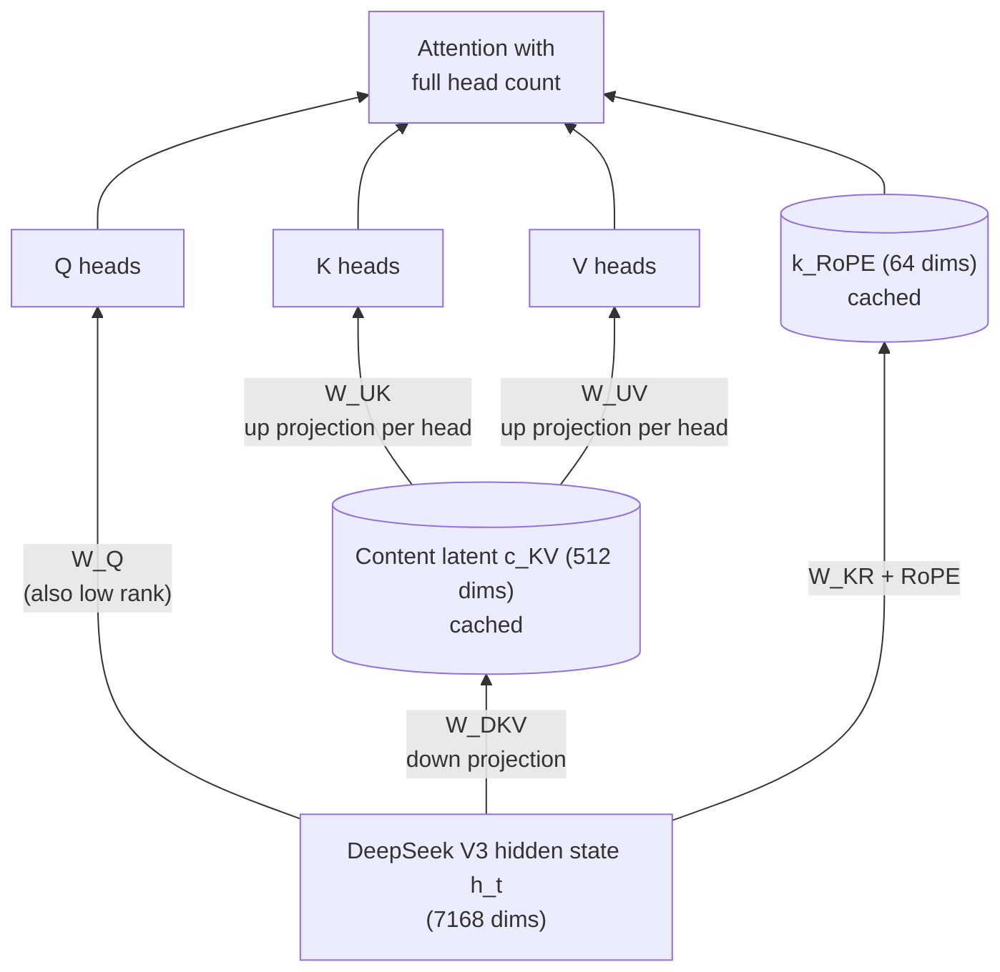
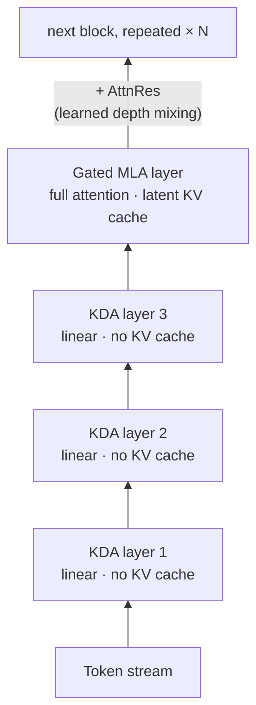
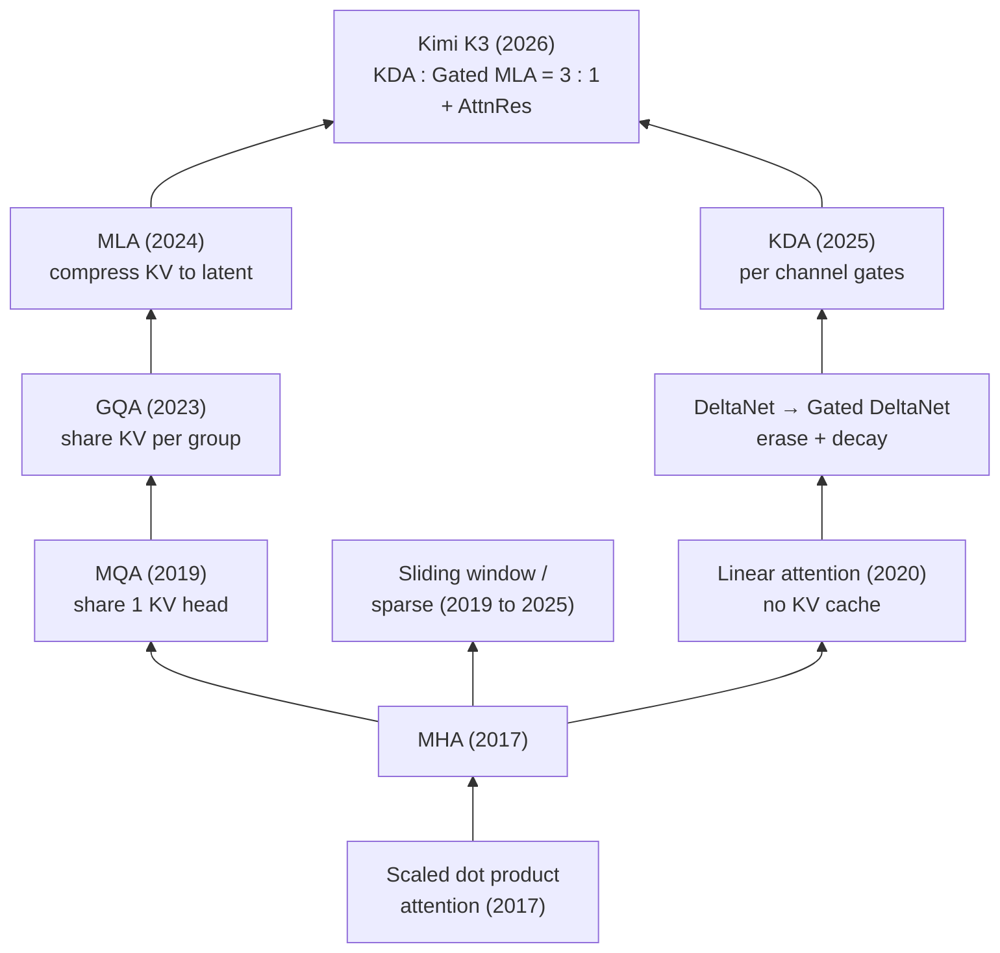

Attention is the core operation of the Transformer, and it is also its main scaling bottleneck. Almost every architectural change in large language models over the past decade, including MQA, GQA, sliding windows, MLA, sparse attention, and linear attention, addresses one or both of the same bottlenecks: the **quadratic compute cost** of attention over sequence length and the **KV cache** that dominates memory and bandwidth during inference.

This post walks through that evolution in order, from the original scaled dot product attention (2017) to Kimi Delta Attention in Kimi K3 (2026), and ends with a table of which model uses which mechanism.

---

## 1. Scaled Dot Product Attention (2017)

The starting point is the attention operation from _Attention Is All You Need_. Each token produces a query $$q$$, a key $$k$$, and a value $$v$$. The output is a weighted average of values, where the weights come from query and key similarity:

$$
\text{Attention}(Q, K, V) = \text{softmax}\!\left(\frac{QK^{\top}}{\sqrt{d_k}}\right)V
$$

Note that $$Q$$, $$K$$, and $$V$$ are not the input itself. They are **learned projections** of it. The input hidden states $$X$$ are multiplied by three weight matrices $$W^Q$$, $$W^K$$, $$W^V$$ to produce queries ("what am I looking for?"), keys ("what do I contain?"), and values ("what do I hand over?"):

The $$\sqrt{d_k}$$ scaling keeps the dot products from saturating the softmax. The important property is that every token attends to every previous token. Both compute and the attention matrix therefore grow as $$O(n^2)$$ in sequence length $$n$$.

## 2. Multi Head Attention (MHA)

The same paper introduced **Multi Head Attention**. Instead of one attention over the full model dimension, it projects the input into $$h$$ smaller subspaces, runs attention independently in each, and concatenates the results:

$$
\text{MHA}(X) = \text{Concat}(\text{head}_1, \ldots, \text{head}_h)\,W^{O}, \quad
\text{head}_i = \text{Attention}(XW_i^{Q},\, XW_i^{K},\, XW_i^{V})
$$

Each head can specialize. One might track syntax while another tracks long range coreference. Every head $$i$$ carries its **own** projection triple $$W_i^Q, W_i^K, W_i^V$$, and a final matrix $$W^O$$ mixes the concatenated heads back into the model dimension:

Because every head has its own $$W_i^K$$ and $$W_i^V$$, every head contributes its own K and V vectors to the cache. That is fine for training, but it defines the inference problem that the next decade of designs tries to solve.

### The KV cache problem

During autoregressive decoding, the keys and values of all past tokens are cached so they are not recomputed at every step. The cache size per token is:

$$
\text{KV bytes/token} = 2 \times n_{\text{layers}} \times n_{\text{KV}} \times d_{\text{head}} \times \text{bytes/element}
$$

For an MHA model shaped like Llama 2 7B (32 layers, 32 KV heads, head dimension 128, FP16), that is about **0.5 MB per token**. A 128K context therefore needs roughly **64 GB of KV cache** for one sequence, before model weights and other runtime memory are counted. Decoding is often limited by memory bandwidth because every generated token must read the existing cache. Shrinking this cache is therefore a central theme of the designs below.

## 3. Multi Query Attention (MQA, 2019)

Noam Shazeer's _Fast Transformer Decoding_ proposed the bluntest possible fix: keep all $$h$$ query heads, but share **one single K/V head** across all of them. The KV cache shrinks by a factor of $$h$$ (32× in the example above), and decoding gets dramatically faster.

The tradeoff can be quality because every query head must use the same key and value representation. The original MQA study reported only minor degradation from its MHA baseline, while later GQA experiments found that using several KV heads could recover quality close to MHA. PaLM and StarCoder are prominent models that used MQA.

## 4. Grouped Query Attention (GQA, 2023)

**GQA** (Ainslie et al., Google) interpolates between the two extremes. It divides the $$h$$ query heads into $$g$$ groups and gives each group one shared K/V head. With $$g = h$$, it becomes MHA. With $$g = 1$$, it becomes MQA. Many deployed models use 8 KV heads as a practical balance. For example, Llama 3 70B uses 64 query heads and 8 KV heads, which reduces the cache for keys and values by a factor of 8 compared with MHA at the same head dimensions.

In the diagram below, solid arrows are projections. Each projection multiplies $$X$$ by a weight matrix to produce a Q or K/V head. Dotted arrows show which K/V head each query head uses. Only the K/V nodes enter the cache. Query heads are recomputed at every step and are never stored:

### GQA vs MQA: one knob, not two mechanisms

It is tempting to think of MQA and GQA as different mechanisms, but they differ in exactly one number: the count of K/V heads $$g$$. In MQA there is a single $$W^K$$/$$W^V$$ pair for the whole layer, so all query heads retrieve information through one shared "view" of the context. In GQA each group of query heads gets its own $$W^K$$/$$W^V$$ pair, so the model keeps several distinct views. MHA and MQA are just the two endpoints of the same knob:

| KV heads $$g$$ | Name | Distinct K/V "views" | KV cache vs MHA |
| :---: | :--- | :---: | :---: |
| $$g = h$$ (e.g. 32) | MHA | 32 | 1× |
| $$1 < g < h$$ (e.g. 8) | GQA | 8 | 4× smaller |
| $$g = 1$$ | MQA | 1 | 32× smaller |

The GQA paper found that an uptrained GQA model achieved quality close to MHA while retaining decoding speed comparable to MQA. The exact relationship between KV head count and quality depends on the model and training setup, so a particular head count should be treated as an engineering choice rather than a universal optimum.

A practical bonus is that a GQA model does not need to be trained from scratch. The paper converted an existing MHA checkpoint by averaging each group's K/V projection matrices into one shared pair, followed by an uptraining run that used about 5% of the original pretraining compute. This procedure produced the paper's GQA variants of T5.

GQA has become common in publicly documented models since 2023. Examples include variants of Llama 2, Llama 3, Llama 4, Mistral, Mixtral, Qwen 2, Qwen 3, Gemma, and GPT OSS.

## 5. Sliding Windows, Sinks, and Sparse Attention

A parallel line of work attacks the $$O(n^2)$$ term itself by not attending to everything.

- **Sliding window attention.** Each token attends only to the last $$w$$ tokens. Longformer introduced a prominent version in 2020, and Mistral 7B later used a 4K window. Gemma 2 and Gemma 3 combine local layers with periodic global layers so information can still travel across the full context through depth.
- **Attention sinks.** StreamingLLM observed that softmax attention often assigns substantial probability to initial tokens even when they carry little semantic value. Keeping a few initial tokens visible can stabilize windowed attention. GPT OSS uses a learned bias in each attention head that acts like an optional sink, and it alternates dense layers with locally banded layers of width 128.
- **Native Sparse Attention.** NSA combines compressed global context, selected token blocks, and a local window. Its hierarchy preserves broad context while allocating fine attention to selected regions.
- **DeepSeek Sparse Attention.** DSA uses a lightweight indexer to score earlier tokens and selects a top $$k$$ subset for the main MLA computation. Unlike NSA, its sparse selection operates at token granularity. Both approaches are trained end to end and reduce the cost of long context attention.

## 6. Multi Head Latent Attention (MLA, 2024)

GQA reduces the cache by sharing heads. **MLA**, introduced in DeepSeek V2, reduces it by **compressing** their content. Instead of caching full K and V vectors for every head, the hidden state is projected into a shared latent vector $$c^{KV}_t$$ with 512 dimensions in DeepSeek V2 and V3. Per head K and V content can be reconstructed from that latent when needed. A separate 64 dimensional key component carries RoPE position information.

For each layer and token, the MLA cache contains the 512 dimensional content latent and the 64 dimensional RoPE key component, for a total of 576 cached values in this configuration. The diagram uses DeepSeek V3 dimensions; DeepSeek V2 has a hidden width of 5120 rather than 7168. At inference time, the reconstruction matrices can be absorbed into the query and output projections, which avoids materializing full per head K and V vectors. DeepSeek V2 reports a **93.3% KV cache reduction** compared with conventional MHA. DeepSeek V2, DeepSeek V3, DeepSeek R1, and Kimi K2 all use MLA.

## 7. Linear Attention and the Delta Rule

The most radical branch removes the softmax entirely. If the attention weights are a plain dot product of feature maps, the computation can be rewritten as a **recurrent state update**. A fixed size matrix $$S_t$$ summarizes the whole past:

$$
S_t = S_{t-1} + v_t k_t^{\top}, \qquad o_t = S_t\, q_t
$$

During autoregressive decoding, the cost of each new token is $$O(1)$$ with respect to the existing context length. Processing a sequence of $$n$$ tokens still takes $$O(n)$$ total work. There is no token growing KV cache, but the recurrent state must be retained. The main challenge is memory quality: naively summing outer products means the state cannot forget or correct an earlier association, and early linear attention performed poorly on exact recall.

Two refinements fixed much of that:

1. **The delta rule (DeltaNet).** Instead of blindly adding, first *erase* what the state currently predicts for key $$k_t$$, then write the new value: $$S_t = S_{t-1}\,(I - \beta_t k_t k_t^{\top}) + \beta_t v_t k_t^{\top}$$. This turns the state into something the model actively edits rather than a running sum.
2. **Gating (Gated DeltaNet).** Add a learned decay so stale information fades: $$S_t = S_{t-1}\,\alpha_t (I - \beta_t k_t k_t^{\top}) + \beta_t v_t k_t^{\top}$$.

Because finite recurrent states can struggle with exact retrieval, several 2025 models use **hybrid** stacks that interleave linear layers with full attention. MiniMax 01 uses seven Lightning Attention layers for each softmax layer. Qwen3 Next uses three Gated DeltaNet layers for each gated full attention layer. Kimi Linear uses three KDA layers for each MLA layer. In experiments on its 48B model, the Kimi Linear paper reports up to 75% lower KV cache use and up to 6 times higher decoding throughput at a 1M token context compared with its full MLA baseline.

## 8. Kimi Delta Attention and Kimi K3 (2026)

**Kimi Delta Attention (KDA)**, introduced in Kimi Linear (late 2025) and scaled up in **Kimi K3**, is the current end of this lineage. KDA refines the gated delta rule in two ways:

- **Per channel forget gates.** Instead of one scalar decay per head, KDA applies a diagonal decay $$\text{Diag}(\alpha_t)$$. Each channel of the state can therefore forget at its own rate, which provides finer memory control than Gated DeltaNet.
- **Bounded decay in Kimi K3.** Kimi K3 maps each log decay into $$(g_{\min}, 0)$$ with a scaled sigmoid and fixes $$g_{\min} = -5$$. The finite range keeps reciprocal rescaling within BF16 range over each 16 token tile. It also lets both diagonal and off diagonal tiles use dense Tensor Core matrix operations.

Kimi K3 is a 2.8T parameter MoE with 104B activated parameters and a 1M token context window. Its 93 attention layers contain **69 KDA layers and 24 Gated MLA layers**, which is approximately a three to one ratio. KDA layers retain fixed size recurrent states, while only the Gated MLA layers maintain token growing latent KV caches. Kimi K3 also uses **Attention Residuals (AttnRes)**. AttnRes learns a softmax weighted mixture over representations from preceding layers. Its block form performs this selection over preceding blocks, which improves information flow through depth while controlling memory and communication cost.

The overall arc is easy to state. MQA and GQA shrink the cache by **sharing** it. MLA shrinks it by **compressing** it. Sparse attention reduces work by **selecting** a subset of the context. Linear attention replaces a token growing cache with a **fixed size recurrent state**. Kimi K3 scales a KDA dominant hybrid of recurrent and full attention to 2.8T total parameters.

---

## Which Model Uses Which Attention

Closed frontier models (GPT 4, GPT 5, Claude, and Gemini) do not disclose their attention internals, so the table covers architectures that are publicly documented.

| Model | Year | Attention type | Notes |
| :--- | :---: | :--- | :--- |
| Transformer (original) | 2017 | MHA | Encoder and decoder architecture with full softmax attention |
| GPT 2 / GPT 3 | 2019 to 2020 | MHA | GPT 3 alternates dense and locally banded sparse layers |
| PaLM | 2022 | MQA | 1 shared KV head |
| LLaMA 1 | 2023 | MHA | |
| StarCoder | 2023 | MQA | |
| Llama 2 (70B) | 2023 | GQA | Smaller sizes kept MHA |
| Mistral 7B | 2023 | GQA + sliding window | 4K local window |
| Llama 3 | 2024 | GQA | 8 KV heads at every size |
| DeepSeek V2 | 2024 | MLA | First deployment of latent KV compression |
| Gemma 2 / 3 | 2024 to 2025 | GQA + local/global | Local attention with periodic global layers |
| DeepSeek V3 / R1 | 2024 to 2025 | MLA | 671B MoE |
| Qwen3 | 2025 | GQA | |
| MiniMax 01 / M1 | 2025 | Hybrid linear (Lightning) | 7 linear : 1 softmax layers |
| Kimi K2 | 2025 | MLA | 1T MoE with a DeepSeek V3 style stack |
| GPT OSS | 2025 | GQA + local attention + sinks | Alternating dense and 128 token local layers with learned sinks |
| Qwen3 Next | 2025 | Hybrid Gated DeltaNet | 3 linear : 1 gated full attention layers |
| DeepSeek V3.2 | 2025 | MLA + DSA | Trainable top $$k$$ token selection on top of MLA |
| Kimi Linear | 2025 | Hybrid KDA + MLA | 3 : 1, introduced KDA |
| **Kimi K3** | **2026** | **Hybrid KDA + Gated MLA** | **69 KDA + 24 Gated MLA, AttnRes, 2.8T MoE, 1M context** |

---

## Takeaways

1. **Cache capacity and attention compute drove different branches of this history.** MQA, GQA, and MLA primarily reduce decoding memory and bandwidth. Sparse and linear attention also reduce the sequence length dependence of computation.
2. **Ideas compose.** Kimi K3 combines recurrent KDA, latent KV compression through MLA, learned depth mixing through AttnRes, and sparse expert computation through MoE.
3. **Hybrid designs balance efficiency and retrieval.** Linear layers handle most token mixing with fixed size states, while periodic full attention layers preserve direct access to individual tokens. MiniMax 01, Qwen3 Next, Kimi Linear, and Kimi K3 apply this principle with different mechanisms and ratios.
