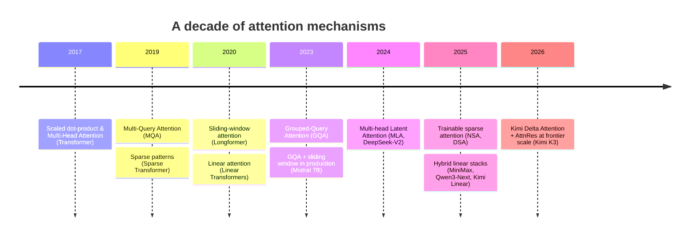
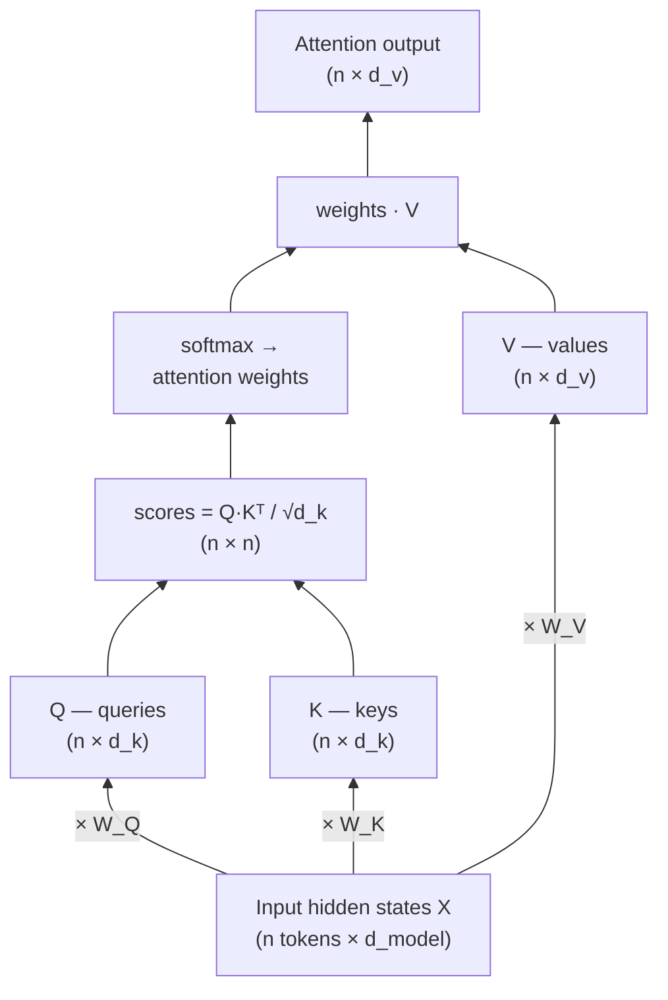
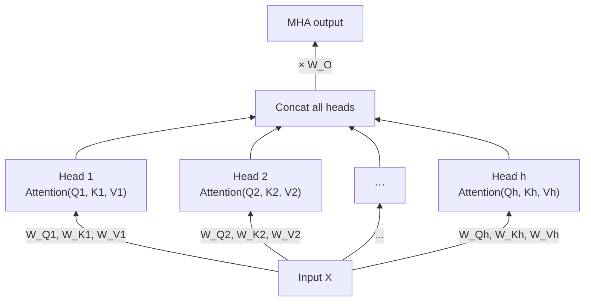
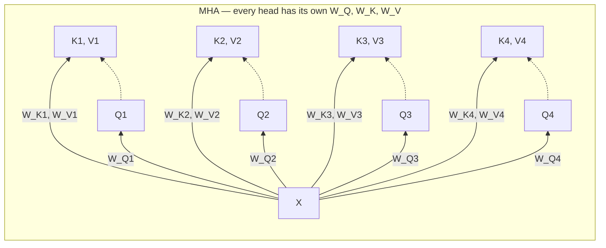
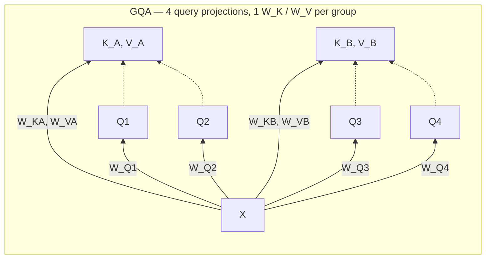
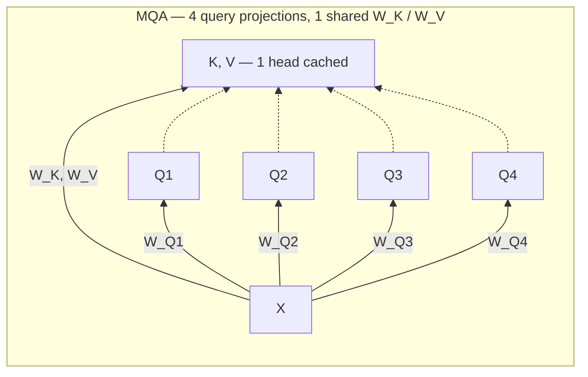
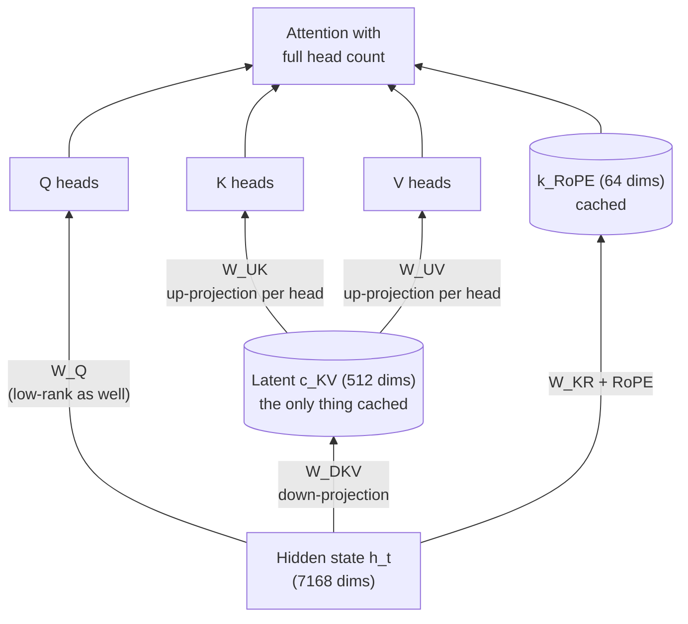
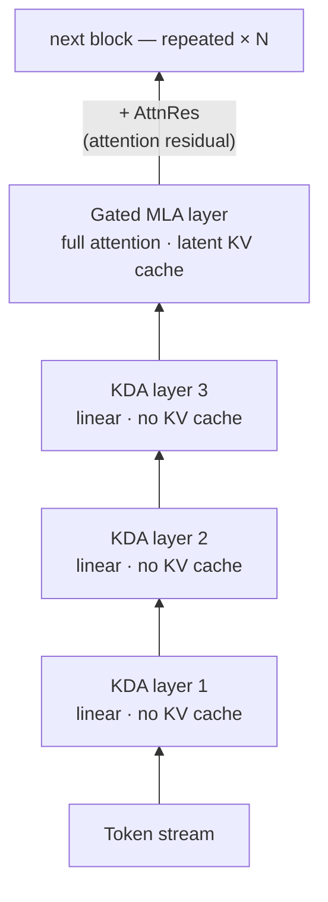
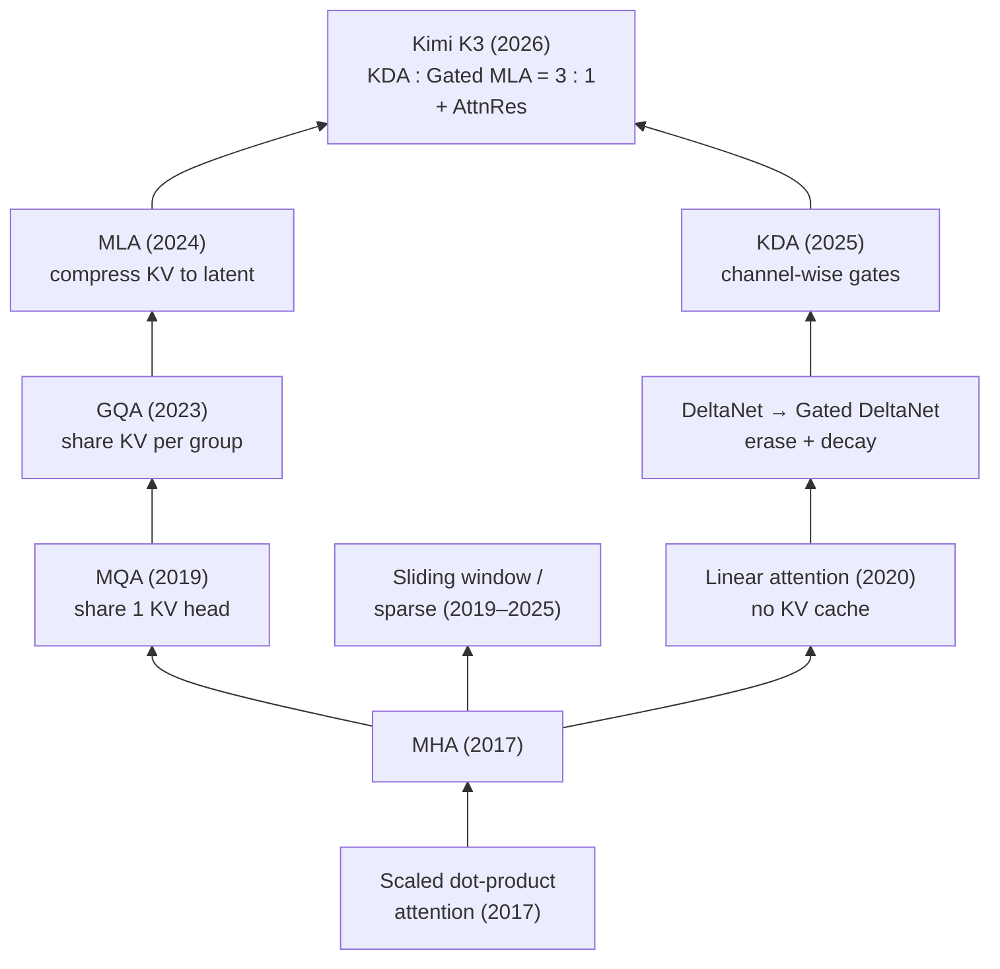

Attention is the core operation of the Transformer, and it is also its main scaling bottleneck. Almost every architectural change in large language models over the past decade — MQA, GQA, sliding windows, MLA, sparse attention, and linear attention — exists to fight the same two enemies: the **quadratic compute cost** of attention over sequence length, and the **KV cache** that dominates memory and bandwidth during inference.

This post walks through that evolution in order, from the original scaled dot-product attention (2017) to Kimi Delta Attention in Kimi K3 (2026), and ends with a table of which model uses which mechanism.

---

## 1. Scaled Dot-Product Attention (2017)

The starting point is the attention operation from _Attention Is All You Need_. Each token produces a query $$q$$, a key $$k$$, and a value $$v$$, and the output is a weighted average of values, where the weights come from query–key similarity:

$$
\text{Attention}(Q, K, V) = \text{softmax}\!\left(\frac{QK^{\top}}{\sqrt{d_k}}\right)V
$$

Note that $$Q$$, $$K$$, and $$V$$ are not the input itself — they are **learned projections** of it. The input hidden states $$X$$ are multiplied by three weight matrices $$W^Q$$, $$W^K$$, $$W^V$$ to produce queries ("what am I looking for?"), keys ("what do I contain?"), and values ("what do I hand over?"):

The $$\sqrt{d_k}$$ scaling keeps the dot products from saturating the softmax. The important property — and the root of every problem that follows — is that every token attends to every previous token, so both compute and the attention matrix grow as $$O(n^2)$$ in sequence length $$n$$.

## 2. Multi-Head Attention (MHA)

The same paper introduced **Multi-Head Attention**: instead of one attention over the full model dimension, project the input into $$h$$ smaller subspaces, run attention independently in each, and concatenate:

$$
\text{MHA}(X) = \text{Concat}(\text{head}_1, \ldots, \text{head}_h)\,W^{O}, \quad
\text{head}_i = \text{Attention}(XW_i^{Q},\, XW_i^{K},\, XW_i^{V})
$$

Each head can specialize — one tracks syntax, another tracks long-range coreference, and so on. Every head $$i$$ carries its **own** projection triple $$W_i^Q, W_i^K, W_i^V$$, and a final matrix $$W^O$$ mixes the concatenated heads back into the model dimension:

Because every head has its own $$W_i^K$$ and $$W_i^V$$, every head contributes its own K and V vectors to the cache. That is fine for training, but it defines the inference problem that the next decade of designs tries to solve.

### The KV cache problem

During autoregressive decoding, the keys and values of all past tokens are cached so they are not recomputed at every step. The cache size per token is:

$$
\text{KV bytes/token} = 2 \times n_{\text{layers}} \times n_{\text{kv-heads}} \times d_{\text{head}} \times \text{bytes/param}
$$

For a Llama-2-7B-shaped MHA model (32 layers, 32 KV heads, head dim 128, FP16) that is about **0.5 MB per token** — roughly **64 GB for a 128K context**, before you store a single model weight. Decoding is memory-bandwidth-bound: every generated token has to stream the whole cache through the GPU. Shrinking the KV cache is therefore the central theme of everything below.

## 3. Multi-Query Attention (MQA, 2019)

Noam Shazeer's _Fast Transformer Decoding_ proposed the bluntest possible fix: keep all $$h$$ query heads, but share **one single K/V head** across all of them. The KV cache shrinks by a factor of $$h$$ (32× in the example above), and decoding gets dramatically faster.

The cost is quality. All heads are forced to look through the same key/value lens, and MQA models show a measurable quality drop and training instability at scale. PaLM and StarCoder shipped with MQA, but it never became the default.

## 4. Grouped-Query Attention (GQA, 2023)

**GQA** (Ainslie et al., Google) is the interpolation between the two extremes: divide the $$h$$ query heads into $$g$$ groups, and give each group one shared K/V head. With $$g = h$$ you recover MHA; with $$g = 1$$ you recover MQA. In practice a small number of KV heads (typically 8) recovers almost all of MHA's quality while keeping most of MQA's memory savings — Llama 3 70B uses 64 query heads and 8 KV heads, an 8× cache reduction.

In the diagram below, solid arrows are projections ($$X$$ times a weight matrix produces a Q or K/V head) and dotted arrows show which K/V head each query head attends with. Only the K/V nodes end up in the cache — the query heads are recomputed every step and never stored:

### GQA vs MQA: one knob, not two mechanisms

It is tempting to think of MQA and GQA as different mechanisms, but they differ in exactly one number: the count of K/V heads $$g$$. In MQA there is a single $$W^K$$/$$W^V$$ pair for the whole layer, so all query heads retrieve information through one shared "view" of the context. In GQA each group of query heads gets its own $$W^K$$/$$W^V$$ pair, so the model keeps several distinct views. MHA and MQA are just the two endpoints of the same knob:

| KV heads $$g$$ | Name | Distinct K/V "views" | KV cache vs MHA |
| :---: | :--- | :---: | :---: |
| $$g = h$$ (e.g. 32) | MHA | 32 | 1× |
| $$1 < g < h$$ (e.g. 8) | GQA | 8 | 4× smaller |
| $$g = 1$$ | MQA | 1 | 32× smaller |

The key empirical finding of the GQA paper is that quality degrades **very non-linearly** along this knob: cutting KV heads from 32 to 8 loses almost nothing, while going from 8 to 1 causes most of MQA's quality drop. Since 8 KV heads already captures ~80–90% of MQA's memory savings, the extra compression of full MQA is simply not worth it — which is why MQA (PaLM, StarCoder) was largely abandoned once GQA appeared.

A practical bonus: a GQA model does not need to be trained from scratch. The paper showed that an existing MHA checkpoint can be **converted** by mean-pooling each group's K/V projection matrices into one shared pair, followed by a short "uptraining" run (~5% of the original compute) to recover quality. This is how the first GQA versions of T5 were produced.

GQA became the industry default from 2023 to today: Llama 2/3/4, Mistral, Mixtral, Qwen 2/3, Gemma, and GPT-OSS all use it.

## 5. Sliding Windows, Sinks, and Sparse Attention

A parallel line of work attacks the $$O(n^2)$$ term itself by not attending to everything.

- **Sliding-window (local) attention** — each token attends only to the last $$w$$ tokens (Longformer, 2020). Mistral 7B popularized it in production (4K window), and Gemma 2/3 alternate local sliding-window layers with occasional global layers so information can still travel far through depth.
- **Attention sinks** — StreamingLLM observed that softmax attention dumps probability mass on the first tokens; keeping a few "sink" tokens always visible stabilizes windowed attention. GPT-OSS (2025) bakes a learned sink into every attention layer and alternates dense and 128-token sliding-window layers.
- **Trainable sparse attention** — instead of a fixed window, learn which blocks of the context each query should visit. DeepSeek's **NSA** (Native Sparse Attention, early 2025) and the **DSA** sparse attention deployed in DeepSeek-V3.2 select a small top-$$k$$ set of key blocks per query, making long-context prefill and decoding near-linear in practice while remaining trainable end-to-end.

## 6. Multi-head Latent Attention (MLA, 2024)

GQA reduces the cache by deleting heads. **MLA**, introduced in DeepSeek-V2, reduces it by **compressing** them. Instead of caching full K and V per head, the hidden state is projected down into one small shared latent vector $$c^{KV}_t$$ (512 dims in DeepSeek-V2/V3, versus 32K+ dims of full MHA cache), and per-head K and V are reconstructed by up-projection when needed. A small decoupled component carries RoPE positional information alongside the latent.

The trick is that the up-projections can be folded into the query and output projections at inference time, so the model behaves like MQA for memory purposes while keeping the expressiveness of many distinct heads. DeepSeek reports a **93% KV cache reduction** versus MHA with quality *better* than MHA, not worse. DeepSeek-V2/V3/R1 and Kimi K2 (a 1T-parameter MoE) all use MLA.

## 7. Linear Attention and the Delta Rule

The most radical branch removes the softmax entirely. If the attention weights are a plain dot product of feature maps, the computation can be rewritten as a **recurrent state update** — a fixed-size matrix $$S_t$$ that summarizes the whole past:

$$
S_t = S_{t-1} + v_t k_t^{\top}, \qquad o_t = S_t\, q_t
$$

Compute per token is $$O(1)$$ regardless of context length, and there is **no KV cache at all** — just the state. The problem is memory quality: naively summing outer products means the state can never forget or correct itself, and early linear attention lagged softmax badly on recall.

Two refinements fixed much of that:

1. **The delta rule (DeltaNet)** — instead of blindly adding, first *erase* what the state currently predicts for key $$k_t$$, then write the new value: $$S_t = S_{t-1}\,(I - \beta_t k_t k_t^{\top}) + \beta_t v_t k_t^{\top}$$. This turns the state into something the model actively edits rather than a running sum.
2. **Gating (Gated DeltaNet)** — add a learned decay so stale information fades: $$S_t = S_{t-1}\,\alpha_t (I - \beta_t k_t k_t^{\top}) + \beta_t v_t k_t^{\top}$$.

Pure linear attention still struggles with exact retrieval, so 2025 models converged on **hybrids**: mostly-linear layers with a few full-attention layers interleaved. MiniMax-01/M1 (Lightning attention, 7:1), Qwen3-Next (Gated DeltaNet + gated full attention, 3:1), and Kimi Linear all follow this pattern.

## 8. Kimi Delta Attention and Kimi K3 (2026)

**Kimi Delta Attention (KDA)**, introduced in Kimi Linear (late 2025) and scaled up in **Kimi K3**, is the current end of this lineage. KDA refines the gated delta rule in two ways:

- **Channel-wise forget gates.** Instead of one scalar decay per head, KDA applies a per-channel diagonal decay $$\text{Diag}(\alpha_t)$$, so each dimension of the state can be forgotten at its own rate — much finer memory control than Gated DeltaNet.
- **Numerical stability at scale.** Recurrent linear attention tends to overflow when trained at trillion-parameter scale; KDA lower-bounds the log-decay with a scaled sigmoid to keep the recurrence stable.

Kimi K3 itself is a 2.8T-parameter MoE with a 1M-token context window. Its attention stack alternates **three KDA layers for every one Gated MLA (full attention) layer**, and adds **Attention Residuals (AttnRes)** — residual paths on the attention outputs that help information flow through very deep stacks. The linear layers carry no KV cache, so the hybrid cuts KV memory by roughly **75%** and reaches up to **~6× faster decoding at 1M-token context** compared with a full-attention baseline.

The overall arc is easy to state: MQA/GQA shrank the cache by **sharing** it, MLA by **compressing** it, sparse attention by **skipping** most of it, and linear attention by **replacing** it with a fixed-size state. Kimi K3 is the first frontier-scale model to bet on the last option as the default, keeping just enough full attention around for exact recall.

---

## Which Model Uses Which Attention

Closed frontier models (GPT-4/5, Claude, Gemini) do not disclose their attention internals, so the table covers architectures that are publicly documented.

| Model | Year | Attention type | Notes |
| :--- | :---: | :--- | :--- |
| Transformer (original) | 2017 | MHA | Encoder–decoder, full softmax attention |
| GPT-2 / GPT-3 | 2019–20 | MHA | GPT-3 alternates dense and banded-sparse layers |
| PaLM | 2022 | MQA | 1 shared KV head |
| LLaMA 1 | 2023 | MHA | |
| StarCoder | 2023 | MQA | |
| Llama 2 (70B) | 2023 | GQA | Smaller sizes kept MHA |
| Mistral 7B | 2023 | GQA + sliding window | 4K local window |
| Llama 3 | 2024 | GQA | 8 KV heads at every size |
| DeepSeek-V2 | 2024 | MLA | First latent-compression deployment |
| Gemma 2 / 3 | 2024–25 | GQA + local/global | Alternating sliding-window and global layers |
| DeepSeek-V3 / R1 | 2024–25 | MLA | 671B MoE |
| Qwen3 | 2025 | GQA | |
| MiniMax-01 / M1 | 2025 | Hybrid linear (Lightning) | 7 linear : 1 softmax layers |
| Kimi K2 | 2025 | MLA | 1T MoE, DeepSeek-V3-style stack |
| GPT-OSS | 2025 | GQA + sliding window + sinks | Alternating dense / 128-token window, learned sinks |
| Qwen3-Next | 2025 | Hybrid Gated DeltaNet | 3 linear : 1 gated full-attention layers |
| DeepSeek-V3.2 | 2025 | MLA + DSA | Trainable top-k sparse attention on top of MLA |
| Kimi Linear | 2025 | Hybrid KDA + MLA | 3 : 1, introduced KDA |
| **Kimi K3** | **2026** | **Hybrid KDA + Gated MLA** | **3 : 1, AttnRes, 2.8T MoE, 1M context, ~75% KV cache reduction** |

---

## Takeaways

1. **The KV cache, not FLOPs, drove most of this history.** MQA, GQA, and MLA are pure inference-economics inventions — the math of attention never changed, only what gets stored.
2. **Ideas compose.** Kimi K3 is simultaneously a linear-attention model (KDA), a latent-compression model (MLA), a gated model, and an MoE. Modern architectures stack every trick that survived.
3. **Hybrids won over purity.** Pure linear attention failed at recall for five years; the 3:1 hybrid pattern (Qwen3-Next, Kimi Linear, Kimi K3) keeps a minority of full-attention layers as the model's "exact memory" and lets cheap linear layers do the bulk of the work.
